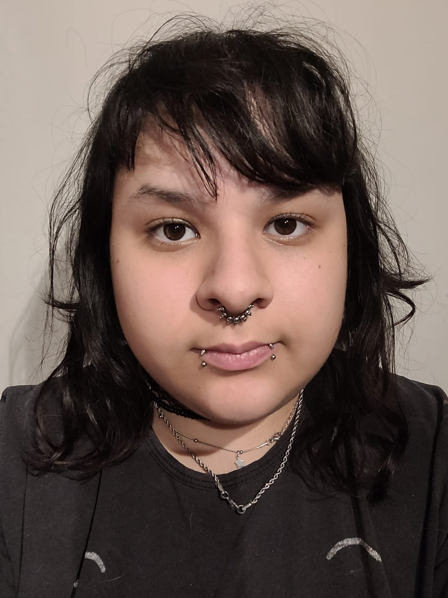
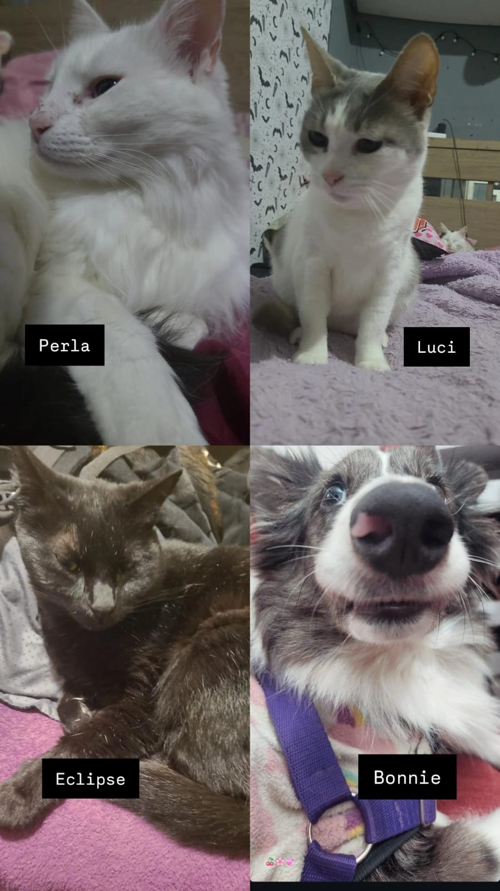

# Programación con objetos I
## Presentación Personal

### Datos Personales
- Buenas! Mi nombre es Dorian Mora. Comencé la universidad a inicios de 2022, y tras muchas interrupciones, a día de hoy (mediados de 2025) sigo adelante con mi carrera. Desde siempre me sentí muy cómoda con las computadoras; me atrae su funcionamiento lógico y la manera en que permiten **crear**, aunque hasta ahora sólo había manejado lo básico. Esta carrera representa mi oportunidad de profundizar en un área que me entusiasma mucho.

- Soy *neurodivergente* y discapacitada por ello, algo que considero importante mencionar porque forma parte de mi identidad y de la manera en que transito el estudio y mi vida. Al mismo tiempo, me enseñó a valorar la salud mental como algo esencial; fui víctima de sus dificultades y eso me ha llevado a ser más consciente y empática.

- En lo laboral, mis experiencias hasta ahora no estuvieron vinculadas a la programación, pero tengo la convicción de que este es el camino al que quiero dedicarme. Creo que puedo aportar creatividad, aunque a veces me quede demasiado en mi zona de confort; siendo un aspecto en el que busco mejorar constantemente.

- Vivo en Hurlingham desde hace aproximadamente 15 años, pero nací en Palermo.

### Otra Información
- Esta materia marca mi inicio en el uso de GitHub.
- Fuera del ámbito académico, me apasionan los videojuegos, la animación y los gatos. De hecho, convivo con tres gatas: Luci, Perla y Eclipse, y mi perrita Bonnie, que son parte fundamental de mi día a día. También disfruto de aprender distintos temas relacionados con la tecnología y la lógica, y me motiva seguir formándome para abrir nuevas puertas en el futuro.

- Además de mis intereses en la programación, disfruto mucho de crear historias de drama, lo que me permitió ejercitar la imaginación y creatividad, explorando emociones intensas y personajes complejos.

- Mi objetivo es seguir creciendo en este camino, combinando lo técnico con lo creativo.
